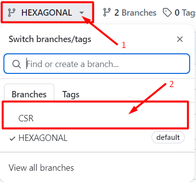

# Bem-vindo

Este repositório aborda dois tipos de arquitetura em microsserviços:

- **Arquitetura Hexagonal**
- Padrão **Controller-Service-Repository**

Você está na branch **HEXAGONAL** e, portanto, o código exibido segue as
especificações da Arquitetura Hexagonal. Caso queira visualizar o código no padrão controller-service-repository, faça
um `git checkout CSR` na sua IDE ou, se estiver visualizando o repositório no github, siga os passos conforme imagem
abaixo:

